# Visual Flow Logger (VFL) System Documentation

## 🎯 System Overview

Visual Flow Logger (VFL) is a sophisticated distributed tracing and flow visualization system designed for Java applications. It provides comprehensive execution flow tracking through annotation-based instrumentation, asynchronous processing, and hierarchical trace visualization.

### Core Design Philosophy
- **Non-intrusive**: Minimal impact on application performance
- **Hierarchical**: Maintains parent-child relationships between execution blocks
- **Distributed**: Supports cross-service trace propagation
- **Flexible**: Multiple buffer and flush strategies
- **Asynchronous**: Background processing with configurable execution models

---

## 🏗️ System Architecture

```mermaid
graph TB
    subgraph "Application Layer"
        A[User Code] --> B[@SubBlock Methods]
        C[VFLStarter] --> D[Root/Continue/Event Blocks]
    end
    
    subgraph "Instrumentation Layer"
        E[ByteBuddy Agent] --> F[VFLAnnotationAdvice]
        F --> G[Runtime Method Interception]
    end
    
    subgraph "Context Management"
        H[ThreadContextManager] --> I[BlockContext Stack]
        I --> J[Thread-Local Storage]
    end
    
    subgraph "Logging Core"
        K[Log API] --> L[VFL Base Class]
        L --> M[Block Lifecycle Management]
    end
    
    subgraph "Buffer Layer"
        N[VFLBuffer Interface]
        O[SynchronousBuffer] --> N
        P[AsyncBuffer] --> N
        Q[NoOpsBuffer] --> N
    end
    
    subgraph "Flush Layer"
        R[VFLFlushHandler Interface]
        S[VFLHubFlushHandler] --> R
        T[NestedJsonFlushHandler] --> R
        U[NoOpsFlushHandler] --> R
    end
    
    subgraph "Data Models"
        V[Block] --> W[Log]
        W --> X[SubBlockStartLog]
        Y[BlockContext] --> Z[BlockEndData]
    end
    
    A --> C
    B --> E
    G --> H
    H --> K
    K --> N
    N --> R
    
    style A fill:#e1f5fe
    style E fill:#f3e5f5
    style H fill:#e8f5e8
    style K fill:#fff3e0
    style N fill:#fce4ec
    style R fill:#f1f8e9
```

---

## 🔧 Core Components Deep Dive

### 1. Initialization & Configuration System

#### VFLInitializer
The system's bootstrapping mechanism using ByteBuddy for runtime instrumentation.

```java
// Core initialization flow
public static synchronized void initialize(VFLAnnotationConfig config) {
    // 1. Install ByteBuddy agent
    Instrumentation inst = ByteBuddyAgent.install();
    
    // 2. Configure method transformation
    new AgentBuilder.Default()
        .type(ElementMatchers.declaresMethod(
            ElementMatchers.isAnnotatedWith(SubBlock.class)))
        .transform(builder -> builder.visit(
            Advice.to(VFLAnnotationAdvice.class)
                .on(ElementMatchers.isAnnotatedWith(SubBlock.class))))
        .installOn(inst);
}
```

**Key Features:**
- **Runtime Instrumentation**: Modifies bytecode at class loading time
- **Selective Transformation**: Only instruments methods with `@SubBlock`
- **Configuration-Driven**: Supports enable/disable via `VFLAnnotationConfig`
- **Error Handling**: Comprehensive logging and fallback mechanisms

#### VFLAnnotationConfig
Configuration container controlling system behavior:

```java
public class VFLAnnotationConfig {
    public final boolean disabled;    // Global on/off switch
    public final VFLBuffer buffer;   // Buffer implementation
}
```

---

### 2. Context Propagation System

#### ThreadContextManager
Thread-local context management for maintaining execution hierarchy.

```mermaid
graph TD
    A[Thread 1] --> B[Stack: Block1]
    B --> C[Stack: Block1 → Block2]
    C --> D[Stack: Block1 → Block2 → Block3]
    
    E[Thread 2] --> F[Stack: BlockA]
    F --> G[Stack: BlockA → BlockB]
    
    H[ThreadLocal Storage] --> A
    H --> E
    
    style A fill:#e3f2fd
    style E fill:#f3e5f5
    style H fill:#e8f5e8
```



**Implementation Details:**
```java
static final ThreadLocal<Stack<BlockContext>> loggerCtxStack = new ThreadLocal<>();

static void PushBlockToThreadLogStack(Block subBlock) {
    if (GetCurrentBlockContext() == null) {
        loggerCtxStack.set(new Stack<>());
    }
    loggerCtxStack.get().push(new BlockContext(subBlock));
}
```

**Context Lifecycle:**
1. **Push**: New block contexts added on method entry
2. **Current**: Top of stack represents active execution context
3. **Pop**: Contexts removed on method exit with cleanup
4. **Cleanup**: ThreadLocal cleared when stack becomes empty

#### BlockContext
Container for execution state:

```java
public class BlockContext {
    public final Block blockInfo;              // Block metadata
    public final AtomicBoolean blockStarted;  // Lifecycle state
    public String currentLogId;                // Chain linking
}
```

---

### 3. Instrumentation & Method Interception

#### VFLAnnotationAdvice
ByteBuddy advice class providing method entry/exit hooks.

**Method Entry Flow:**
```java
@Advice.OnMethodEnter
public static void onEnter(@Advice.Origin Method method,
                          @Advice.AllArguments Object[] args) {
    // 1. Resolve block name with placeholder substitution
    String blockName = VFLHelper.ResolveBlockName(method, args);
    
    // 2. Create and link new sub-block
    Block subBlock = VFLFlowHelper.CreateBlockAndPush2Buffer(
        blockName, parentContext.blockInfo.getId(), buffer);
    
    // 3. Update thread context
    ThreadContextManager.PushBlockToThreadLogStack(subBlock);
}
```

**Method Exit Flow:**
```java
@Advice.OnMethodExit(onThrowable = Throwable.class)
public static void onExit(/* parameters */) {
    // 1. Handle exceptions
    if (threw != null) {
        Log.Error("Exception in SubBlock: {}", threw.getMessage());
    }
    
    // 2. Resolve end message with return value
    String endMsg = VFLHelper.ResolveEndMessage(method, args, returnedValue);
    
    // 3. Clean up context
    ThreadContextManager.PopCurrentStack(endMsg);
}
```

#### Placeholder Resolution System
Dynamic message templating supporting method arguments and return values:

```java
// Argument placeholders: {0}, {1}, {2}...
private static final Pattern PLACEHOLDER_PATTERN = Pattern.compile("\\{(\\d+)}");

// Return value placeholders: {r}, {return}
private static final Pattern RETURN_PLACEHOLDER_PATTERN = 
    Pattern.compile("\\{r(?:eturn)?}", Pattern.CASE_INSENSITIVE);
```

**Example Usage:**
```java
@SubBlock(
    blockName = "Process {0}",
    startMessage = "Starting {0} processing",
    endMessage = "Completed {0} -> {r}"
)
public String processOrder(String orderId) {
    return "ORDER-" + orderId + "-PROCESSED";
}
```

---

### 4. Entry Point System (VFLStarter)

#### Root Block Creation
```java
public static <R> R StartRootBlock(String blockName, Supplier<R> supplier) {
    // 1. Create root block
    Block rootBlock = VFLFlowHelper.CreateBlockAndPush2Buffer(
        blockName, null, buffer);
    
    // 2. Initialize context
    ThreadContextManager.PushBlockToThreadLogStack(rootBlock);
    
    try {
        return supplier.get();  // Execute user code
    } catch (Exception e) {
        Log.Error("Exception: {}", e.getMessage());
        throw new RuntimeException(e);
    } finally {
        // 3. Cleanup and flush
        ThreadContextManager.PopCurrentStack(null);
        buffer.flush();
    }
}
```

#### Distributed Tracing Support
```java
public static <R> R ContinueFromBlock(Block continuationBlock, Supplier<R> supplier) {
    // Continue trace from another service/thread
    ThreadContextManager.PushBlockToThreadLogStack(continuationBlock);
    // ... execution logic
}
```

#### Event Listener Integration
```java
public static <R> R StartEventListener(EventPublisherBlock publisherBlock,
                                      String eventListenerName,
                                      Supplier<R> supplier) {
    // Link async event processing to original trace
    Block eventListenerBlock = VFLFlowHelper.CreateBlockAndPush2Buffer(
        eventListenerName, publisherBlock.block().getId(), buffer);
    // ... execution logic
}
```

---

### 5. Asynchronous Processing (VFLFutures)

#### CompletableFuture Integration
Maintains trace context across async boundaries:

```java
public static <R> CompletableFuture<R> supplyAsync(Supplier<R> supplier, Executor executor) {
    return CompletableFuture.supplyAsync(wrapSupplier(supplier), executor);
}

private static <R> Supplier<R> wrapSupplier(Supplier<R> supplier) {
    BlockContext parentContext = ThreadContextManager.GetCurrentBlockContext();
    
    return () -> {
        try {
            // Create lambda sub-block
            var lambdaSubBlock = VFLFlowHelper.CreateBlockAndPush2Buffer(
                "Lambda_JOIN block", parentContext.blockInfo.getId(), buffer);
            
            ThreadContextManager.PushBlockToThreadLogStack(lambdaSubBlock);
            return supplier.get();
        } finally {
            ThreadContextManager.PopCurrentStack(null);
        }
    };
}
```

**Join vs No-Join Classification:**
- **JOIN blocks**: Results are waited upon (synchronization points)
- **NO_JOIN blocks**: Fire-and-forget operations

---

### 6. Buffer Architecture

#### Buffer Hierarchy


#### SynchronousBuffer
Immediate, blocking flush operations:
```java
protected void executeFlushAll(List<Log> logs, /*...*/) {
    performOrderedFlush(logs, blocks, blockStarts, blockEnds);
}
```

**Characteristics:**
- **Predictable**: Flush completes before method returns
- **Simple**: No threading complexity
- **Blocking**: Caller pays flush overhead

#### AsyncBuffer
Background, non-blocking flush operations:

```java
protected void executeFlushAll(List<Log> logs, /*...*/) {
    try {
        flushExecutor.submit(() -> performOrderedFlush(logs, blocks, blockStarts, blockEnds));
    } catch (RejectedExecutionException e) {
        // Fallback to synchronous flush during shutdown
        performOrderedFlush(logs, blocks, blockStarts, blockEnds);
    }
}
```

**Features:**
- **Periodic Flushing**: Scheduled executor for time-based flushes
- **Graceful Shutdown**: Timeout-based termination with fallback
- **Error Handling**: Synchronous fallback when executor unavailable

#### Buffer Lifecycle Management

**Automatic Flushing Logic:**
```java
private void flushIfFull() {
    int totalSize = logs.size() + blocks.size() + starts.size() + ends.size();
    if (totalSize > bufferSize) {
        flushAll();
    }
}
```

**Thread-Safe Batch Creation:**
```java
protected void flushAll() {
    lock.lock();
    try {
        // Create snapshots
        logsToFlush = new ArrayList<>(logs2Flush);
        // Clear buffers
        logs2Flush.clear();
    } finally {
        lock.unlock(); // Release before processing
    }
    
    onFlushAll(logsToFlush, /*...*/); // Process without lock
}
```

---

### 7. Flush Handler System

#### VFLFlushHandler Interface
Abstraction for destination-specific data delivery:

```java
public interface VFLFlushHandler {
    boolean pushLogsToServer(List<Log> logs);
    boolean pushBlocksToServer(List<Block> blocks);
    boolean pushBlockStartsToServer(Map<String, Long> blockStarts);
    boolean pushBlockEndsToServer(Map<String, BlockEndData> blockEnds);
    void closeFlushHandler();
}
```

#### VFLHubFlushHandler
HTTP-based flush handler for remote VFL Hub:

```java
private <T> boolean postData(T data, String endpoint, String dataDescription) {
    try {
        String jsonBody = objectMapper.writeValueAsString(data);
        HttpRequest request = HttpRequest.newBuilder()
            .POST(HttpRequest.BodyPublishers.ofString(jsonBody))
            .uri(URI.create(fullUrl))
            .header("Content-Type", "application/json")
            .build();
        
        HttpResponse<String> response = httpClient.send(request, 
            HttpResponse.BodyHandlers.ofString());
        
        return response.statusCode() >= 200 && response.statusCode() < 300;
    } catch (Exception e) {
        log.error("Error pushing {} to server", dataDescription, e);
        return false;
    }
}
```

#### NestedJsonFlushHandler
Development-focused hierarchical JSON output:

**Output Structure:**
```json
[
  {
    "blockId": "root-block-id",
    "name": "ProcessOrder",
    "startTime": "2024-01-01 10:00:00.000",
    "endTime": "2024-01-01 10:00:05.250",
    "duration": "5.250s",
    "logsChain": [
      {
        "id": "log-1",
        "type": "MESSAGE",
        "message": "Starting order validation",
        "timestamp": "2024-01-01 10:00:01.000",
        "referencedBlock": {
          "blockId": "sub-block-id",
          "name": "ValidateOrder",
          "duration": "1.200s"
        }
      }
    ]
  }
]
```

#### Ordered Flush Sequence
Ensures referential integrity:

```java
protected final void performOrderedFlush(/*...*/) {
    if (!blocks.isEmpty()) 
        flushHandler.pushBlocksToServer(blocks);      // 1. Structure
    if (!blockStarts.isEmpty()) 
        flushHandler.pushBlockStartsToServer(starts); // 2. Start events
    if (!blockEnds.isEmpty()) 
        flushHandler.pushBlockEndsToServer(ends);     // 3. End events
    if (!logs.isEmpty()) 
        flushHandler.pushLogsToServer(logs);          // 4. Messages
}
```

---

### 8. Data Models

#### Block Model
Core execution unit representation:
```java
public class Block {
    private String id;                  // Unique identifier
    private String parentBlockId;       // Hierarchy linking
    private String blockName;           // Display name
}
```

#### Log Models Hierarchy


#### Log Type System
Comprehensive classification:

**Basic Log Types:**
- `MESSAGE`: Informational logs
- `WARN`: Warning conditions
- `ERROR`: Error conditions

**Block Start Types:**
- `SUB_BLOCK_START_PRIMARY`: Method-level sub-blocks
- `SUB_BLOCK_START_SECONDARY_JOIN`: Async operations (waited)
- `SUB_BLOCK_START_SECONDARY_NO_JOIN`: Async operations (fire-and-forget)
- `PUBLISH_EVENT`: Event publishing logs
- `EVENT_LISTENER`: Event consumption logs
- `SUB_BLOCK_CONTINUE`: Cross-service continuation
- `SUB_BLOCK_CONTINUE_COMPLETE`: Continuation completion

---

### 9. Logging API

#### Static Logging Methods
User-friendly API surface:

```java
public class Log {
    // Simple message logging
    public static void Info(String message, Object... args);
    public static void Warn(String message, Object... args);
    public static void Error(String message, Object... args);
    
    // Function execution with result logging
    public static <R> R InfoFn(Supplier<R> fn, String message, Object... args);
    public static <R> R WarnFn(Supplier<R> fn, Function<R, String> messageSerializer);
    
    // Event publishing
    public static EventPublisherBlock Publish(String publisherName, String message);
    
    // Continuation blocks
    public static <R> R CreateContinuationBlock(String blockName, Function<Block, R> fn);
}
```

#### VFL Core Engine
Abstract base providing core functionality:

```java
public abstract class VFL {
    // Ensure block lifecycle
    public final void ensureBlockStarted() {
        if (context.blockStarted.compareAndSet(false, true)) {
            getBuffer().pushLogStartToBuffer(context.blockInfo.getId(), timestamp);
        }
    }
    
    // Core logging implementation
    private void logInternal(LogTypeEnum type, String message) {
        ensureBlockStarted();
        var createdLog = VFLFlowHelper.CreateLogAndPush2Buffer(/*...*/);
        context.currentLogId = createdLog.getId(); // Chain linking
    }
    
    // Function execution with logging
    private <R> R logFnInternal(LogTypeEnum type, Supplier<R> fn, Function<R, String> serializer) {
        R result = fn.get();
        String message = serializer.apply(result);
        logInternal(type, message);
        return result;
    }
}
```

---

### 10. Helper Utilities

#### VFLHelper
Utility functions for common operations:

```java
public class VFLHelper {
    // Message formatting (SLF4J-style)
    public static String FormatMessage(String message, Object... args);
    
    // Placeholder resolution
    public static String ReplaceArgPlaceholders(String text, Object[] args);
    public static String ReplaceReturnPlaceholder(String text, Object returnValue);
    
    // Method introspection
    public static String ResolveBlockName(Method method, Object[] args);
    public static String ResolveStartMessage(Method method, Object[] args);
    public static String ResolveEndMessage(Method method, Object[] args, Object returnValue);
    
    // Utility functions
    public static String UID();
    public static String GetThreadInfo();
    public static String TrimId(String fullId);
}
```

#### VFLFlowHelper
Flow management operations:

```java
public class VFLFlowHelper {
    // Block creation and buffer integration
    public static Block CreateBlockAndPush2Buffer(String blockName, 
                                                  String parentBlockId, 
                                                  VFLBuffer buffer);
    
    // Log creation with type safety
    public static Log CreateLogAndPush2Buffer(String blockId, 
                                              String parentLogId, 
                                              LogTypeEnum logType, 
                                              String message, 
                                              VFLBuffer buffer);
    
    // Sub-block start log creation
    public static SubBlockStartLog CreateLogAndPush2Buffer(String blockId,
                                                           String parentLogId,
                                                           String startMessage,
                                                           String referencedBlockId,
                                                           LogTypeBlockStartEnum logType,
                                                           VFLBuffer buffer);
}
```

---

## 🔄 System Flow Examples

### 1. Simple Method Execution Flow

```java
@SubBlock(
    blockName = "Validate Order {0}",
    startMessage = "Starting validation for {0}",
    endMessage = "Validation result: {r}"
)
public boolean validateOrder(String orderId) {
    Log.Info("Checking order {} in database", orderId);
    // Business logic
    return true;
}
```

**Execution Trace:**


### 2. Distributed Tracing Flow

```java
// Service A
VFLStarter.StartRootBlock("ProcessPayment", () -> {
    // Create continuation block for Service B
    Log.CreateContinuationBlock("PaymentValidation", block -> {
        sendToServiceB(block); // Pass block in HTTP header
        return null;
    });
});

// Service B
Block receivedBlock = deserializeFromHeader(request);
VFLStarter.ContinueFromBlock(receivedBlock, () -> {
    validatePayment();
});
```

### 3. Asynchronous Processing Flow

```java
VFLStarter.StartRootBlock("ProcessOrder", () -> {
    // Async operation with trace context preservation
    CompletableFuture<String> future = VFLFutures.supplyAsync(() -> {
        Log.Info("Processing in background");
        return fetchOrderDetails();
    }, executor);
    
    // Other synchronous work
    Log.Info("Continuing with main thread work");
    
    return future.join(); // Wait for async result
});
```

---

## 🎛️ Configuration Examples

### Development Configuration
```java
// File-based output for development
VFLFlushHandler handler = new NestedJsonFlushHandler("./traces/trace.json");
VFLBuffer buffer = new SynchronousBuffer(50, handler);
VFLAnnotationConfig config = new VFLAnnotationConfig(false, buffer);
VFLInitializer.initialize(config);
```

### Production Configuration
```java
// Async buffer with HTTP flush to VFL Hub
VFLFlushHandler handler = new VFLHubFlushHandler(URI.create("http://vfl-hub:8080"));
ExecutorService flushExecutor = Executors.newFixedThreadPool(2);
ScheduledExecutorService periodicExecutor = Executors.newScheduledThreadPool(1);

VFLBuffer buffer = new AsyncBuffer(
    1000,                    // Buffer size
    5000,                    // Flush timeout (5s)
    1000,                    // Periodic flush interval (1s)
    handler,
    flushExecutor,
    periodicExecutor
);

VFLAnnotationConfig config = new VFLAnnotationConfig(false, buffer);
VFLInitializer.initialize(config);
```

### Disabled Configuration
```java
// Completely disable VFL
VFLBuffer buffer = new NoOpsBuffer();
VFLAnnotationConfig config = new VFLAnnotationConfig(true, buffer);
VFLInitializer.initialize(config);
```

---

## 🔍 Performance Characteristics

### Memory Usage
- **Context Storage**: O(call stack depth) per thread
- **Buffer Storage**: Configurable batch sizes
- **Metadata Overhead**: ~200 bytes per block/log entry

### CPU Impact
- **Method Interception**: ~10-50ns overhead per @SubBlock method
- **Context Management**: Thread-local access (~1-5ns)
- **Background Processing**: Isolated in separate thread pools

### I/O Patterns
- **Synchronous Buffer**: Blocking I/O on caller thread
- **Asynchronous Buffer**: Batched background I/O
- **Flush Ordering**: Ensures referential integrity

---

## 🚀 Advanced Features

### Custom Buffer Implementation
```java
public class CustomBuffer extends VFLBufferWithFlushHandlerBase {
    public CustomBuffer(int bufferSize, VFLFlushHandler handler) {
        super(bufferSize, handler);
    }
    
    @Override
    protected void executeFlushAll(List<Log> logs, /*...*/) {
        // Custom flush logic (e.g., priority-based, filtered)
        CompletableFuture.runAsync(() -> 
            performOrderedFlush(logs, blocks, starts, ends));
    }
}
```

### Custom Flush Handler
```java
public class KafkaFlushHandler implements VFLFlushHandler {
    private final KafkaProducer<String, String> producer;
    
    @Override
    public boolean pushLogsToServer(List<Log> logs) {
        try {
            for (Log log : logs) {
                ProducerRecord<String, String> record = 
                    new ProducerRecord<>("vfl-logs", log.getBlockId(), serialize(log));
                producer.send(record);
            }
            return true;
        } catch (Exception e) {
            return false;
        }
    }
}
```

---

## 📊 Monitoring & Observability

The system provides multiple levels of observability:

1. **Application Traces**: Complete execution flow visualization
2. **System Metrics**: Buffer utilization, flush performance
3. **Error Tracking**: Exception capture and propagation
4. **Performance Analysis**: Execution timing and bottleneck identification

This comprehensive architecture enables deep insights into application behavior while maintaining minimal performance overhead and maximum flexibility for diverse deployment scenarios.