# Visual Flow Logger (VFL)

## What is Visual Flow Logger?

**Visual Flow Logger (VFL)** is a **Structured Logging Framework** designed to capture and visualize how your applications actually execute. Unlike traditional flat logging that gives you disconnected log entries, VFL creates a structured, hierarchical representation of your program's flow that shows the relationships between different operations and how they unfold over time.

VFL supports **distributed tracing**, meaning the structured flow of a single operation can seamlessly span multiple services and systems, giving you a complete picture of complex workflows across your entire architecture.

## Why VFL?

Traditional logging gives you this:
```
[INFO] Processing user order
[INFO] Validating payment method
[INFO] Checking inventory 
[INFO] Payment processed
[INFO] Inventory updated
[INFO] Order completed
```

VFL gives you this structured view:
```
📁 Process User Order
  ├── 📝 Starting order processing
  ├── 📁 Payment Processing (parallel)
  │   ├── 📝 Validating payment method
  │   ├── 📝 Contacting payment gateway
  │   └── 📝 Payment authorized
  ├── 📁 Inventory Check (parallel)
  │   ├── 📝 Checking product availability
  │   └── 📝 Stock confirmed
  ├── 📝 Creating order record
  └── 📝 Order #12345 completed
```

## Key Features

### Multiple Flow Patterns

VFL can represent the full spectrum of modern application execution patterns:

- **Sequential Flow** - Step-by-step operations that happen one after another
- **Parallel Operations** - Multiple operations running simultaneously
- **Fire-and-Forget** - Background tasks that don't need to report back
- **Rejoining Parallel** - Parallel operations that eventually merge back into the main flow
- **Event-Driven** - Publisher/subscriber patterns and event-driven architectures
- **Cross-Service Flows** - Operations that span multiple microservices or distributed systems

### Distributed Tracing

VFL's structured approach naturally extends across service boundaries. When Service A calls Service B, VFL maintains the hierarchical structure, showing you:

- How requests flow between services
- Timing relationships across your architecture
- The complete end-to-end journey of complex operations
- Dependencies and interactions in distributed systems

### Flexible Representation

VFL adapts to your architecture rather than forcing you into a rigid logging pattern:

- **Microservices**: Track requests as they flow through multiple services
- **Monoliths**: Understand complex internal workflows and dependencies
- **Hybrid Systems**: Get visibility into both internal operations and external service calls
- **Event-Driven Systems**: Visualize how events propagate through your system

## Design Philosophy

### Everything is Blocks and Logs

VFL is built on two fundamental concepts:

#### **Blocks**
Blocks represent **scopes of execution** - any meaningful boundary in your application:
- Method calls
- Service operations
- Database transactions
- API requests
- Business processes
- Or any other logical grouping that makes sense to you

Each block contains:
- **Unique identifier** for linking and referencing
- **Human-readable name** describing its purpose
- **Timestamps** showing when it started and ended
- **Hierarchical relationships** to parent and child blocks

#### **Logs**
Logs are the **individual events** that happen within blocks:
- Method entry and exit points
- Decision points and conditions
- Data transformations
- External service calls
- Error conditions
- Or any other significant events

Logs are:
- **Chronologically ordered** within their block
- **Linked to their containing block** for context
- **Typed** to indicate their significance (info, warning, error, etc.)

### Nested Structure

The power of VFL comes from how blocks and logs work together:

- **Blocks contain logs** showing step-by-step execution
- **Logs can reference other blocks**, creating hierarchical relationships
- **Child blocks** represent sub-operations or deeper detail levels
- **Parent blocks** provide context for understanding the bigger picture

This creates a natural tree structure that mirrors how applications actually execute - from high-level business operations down to detailed implementation steps.

### User-Defined Semantics

VFL doesn't impose rigid meanings on your log types or block structures. You decide:

- **What constitutes a meaningful block** boundary
- **How to categorize different types of logs** (info, warning, error, debug, etc.)
- **What level of detail** to capture
- **How to structure** your hierarchical flows

This flexibility means VFL can adapt to any application architecture, programming paradigm, or business domain.

## The VFL Advantage

VFL transforms logging from a debugging afterthought into a powerful tool for:

- **Understanding complex systems** through clear visual structure
- **Debugging distributed applications** with end-to-end trace visibility
- **Performance analysis** with timing relationships preserved
- **System monitoring** with meaningful operational context
- **Team collaboration** through shared understanding of application flow

Whether you're building a simple application or managing a complex distributed system, VFL provides the structured visibility you need to understand, debug, and optimize your software.

## Flow Examples

### Simple Sequential Flow

```mermaid
graph TD
    A[📁 User Registration Process] --> B[📝 Starting user registration for email: john@example.com]
    A --> C[📁 Email Validation]
    C --> C1[📝 Checking email format]
    C --> C2[📝 Email format is valid]
    C --> C3[📝 Checking if email already exists]
    C --> C4[📝 Email is available]
    A --> D[📁 Password Processing]
    D --> D1[📝 Validating password strength]
    D --> D2[📝 Password meets requirements]
    D --> D3[📝 Generating password hash]
    D --> D4[📝 Password hashed successfully]
    A --> E[📁 Database Operations]
    E --> E1[📝 Creating user record]
    E --> E2[📝 Saving to users table]
    E --> E3[📝 User created with ID: 12345]
    A --> F[📝 Registration completed successfully]
```



### Parallel Operations with Rejoining

```mermaid
graph TD
    A[📁 E-commerce Order Processing] --> B[📝 Processing order #ORD-789]
    A --> C[📝 Starting parallel validations]
    
    %% Parallel branches
    A --> D[📁 Payment Authorization ⏱️ 1.2s]
    A --> E[📁 Inventory Check ⏱️ 0.8s]
    
    %% Payment branch
    D --> D1[📝 Validating credit card details]
    D --> D2[📝 Contacting payment gateway]
    D --> D3[📝 Payment authorized: $149.99]
    D --> D4[📝 Transaction ID: TXN-ABC123]
    
    %% Inventory branch  
    E --> E1[📝 Checking product availability]
    E --> E2[📝 Product SKU-001: 15 units available]
    E --> E3[📝 Product SKU-002: 8 units available]
    E --> E4[📝 All items in stock - reserving inventory]
    
    %% Rejoining
    D4 --> F[📝 Both validations completed - proceeding]
    E4 --> F
    F --> G[📁 Order Creation]
    G --> G1[📝 Generating order confirmation]
    G --> G2[📝 Updating inventory levels]
    G --> G3[📝 Order record saved]
    A --> H[📝 Order processing completed]
```



### Fire-and-Forget Background Operations

```mermaid
graph TD
    A[📁 User Profile Update] --> B[📝 Updating profile for user: john_doe]
    A --> C[📁 Profile Validation]
    C --> C1[📝 Validating profile fields]
    C --> C2[⚠️ Profile image size is large 2.5MB]
    C --> C3[📝 Validation passed]
    
    A --> D[📁 Database Update]
    D --> D1[📝 Updating user_profiles table]
    D --> D2[📝 Profile updated successfully]
    
    %% Fire-and-forget operations (parallel, no return)
    A --> E[📁 Cache Invalidation 🔥]
    A --> F[📁 Analytics Tracking 🔥]
    A --> G[📁 Email Notification 🔥]
    
    E --> E1[📝 Invalidating user cache]
    E --> E2[📝 Cache cleared for user: john_doe]
    
    F --> F1[📝 Recording profile update event]
    F --> F2[📝 Event sent to analytics service]
    
    G --> G1[📝 Preparing profile update email]
    G --> G2[📝 Sending notification email]
    G --> G3[📝 Email queued successfully]
    
    A --> H[📝 Profile update completed - background tasks initiated]
    
    %% Styling for fire-and-forget
    classDef fireForget fill:#ffeb3b,stroke:#f57f17,stroke-width:2px,stroke-dasharray: 5 5
    class E,F,G fireForget
```



### Event-Driven Architecture

```mermaid
graph TD
    A[📁 Order Placed Event Handler] --> B[📝 Received order placed event: ORDER-999]
    A --> C[📊 Publishing Event: Order Confirmed]
    C --> C1[📝 Event published with payload]
    
    %% Event listeners (parallel processing)
    C --> D[📡 Inventory Service Listener]
    C --> E[📡 Shipping Service Listener]  
    C --> F[📡 Customer Service Listener]
    
    %% Inventory Service
    D --> D1[📝 Listening for order confirmed events]
    D --> D2[📝 Processing order: ORDER-999]
    D --> D3[📝 Updating stock levels]
    D --> D4[📝 Stock updated for 3 items]
    D --> D5[📝 Inventory processing completed]
    
    %% Shipping Service
    E --> E1[📝 Listening for order confirmed events]
    E --> E2[📝 Creating shipping label for ORDER-999]
    E --> E3[📝 Calculating shipping cost: $12.99]
    E --> E4[📝 Scheduling pickup with carrier]
    E --> E5[📝 Shipping arranged - tracking: TRACK-456]
    
    %% Customer Service
    F --> F1[📝 Listening for order confirmed events]
    F --> F2[📝 Sending order confirmation email]
    F --> F3[📝 Updating customer order history]
    F --> F4[📝 Customer notification completed]
    
    A --> G[📝 All event listeners processed successfully]
    
    %% Styling
    classDef publisher fill:#4caf50,stroke:#2e7d32,stroke-width:3px
    classDef listener fill:#2196f3,stroke:#1565c0,stroke-width:2px
    class C publisher
    class D,E,F listener
```



### Distributed Cross-Service Flow


### Error Handling and Recovery

```mermaid
graph TD
    A[📁 Payment Processing with Fallback] --> B[📝 Processing payment for order: ORD-555]
    
    A --> C[📁 Primary Payment Gateway]
    C --> C1[📝 Attempting payment with Stripe]
    C --> C2[📝 Sending payment request]
    C --> C3[❌ Payment gateway timeout after 5 seconds]
    C --> C4[❌ Primary gateway failed - initiating fallback]
    
    C4 --> D[📁 Fallback Payment Gateway]
    D --> D1[📝 Switching to PayPal gateway]
    D --> D2[⚠️ Using fallback payment method]
    D --> D3[📝 Sending payment request to PayPal]
    D --> D4[📝 Payment processed successfully]
    D --> D5[📝 Transaction ID: PP-789-XYZ]
    
    %% Fire-and-forget notification
    C4 --> E[📁 Notification Service 🔥]
    E --> E1[📝 Alerting ops team about gateway failure]
    E --> E2[📝 Alert sent to monitoring system]
    
    A --> F[📝 Payment completed using fallback method]
    
    %% Styling
    classDef error fill:#f44336,stroke:#c62828,stroke-width:2px
    classDef warning fill:#ff9800,stroke:#f57c00,stroke-width:2px
    classDef fireForget fill:#ffeb3b,stroke:#f57f17,stroke-width:2px,stroke-dasharray: 5 5
    
    class C3,C4 error
    class D2 warning
    class E fireForget
```



## Legend

- 📁 **Block** - A scope of execution (method, operation, service call)
- 📝 **Info Log** - Normal execution information
- ⚠️ **Warning Log** - Concerning but non-critical events
- ❌ **Error Log** - Error conditions and failures
- 📊 **Event Publisher** - Creates events for other services/components
- 📡 **Event Listener** - Responds to published events
- 🔥 **Fire-and-Forget** - Background operation that doesn't block main flow
- 🌐 **Cross-Service** - Operation spanning multiple services
- ⏱️ **Timing** - Duration information for operations